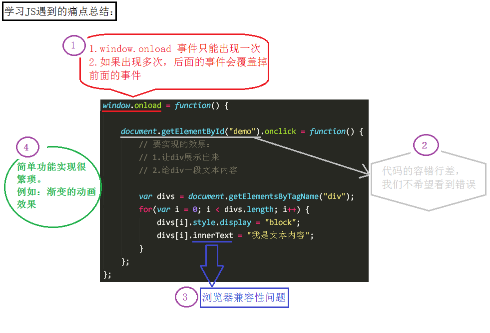

## jQuery介绍

####  jQuery是什么？

jQuery其实是js的一个库（框架），它封装了我们开发中常用的一些功能，方便我们调用，提高了我们的开发效率。

#### 为什么要学jQuery？

- 先以一张图说明人们在学习JS在过程中遇到的痛点

jQuery恰好能解决这些痛点，于是乎jQuery成了目前使用最广泛的JavaScript函数库。

#### 使用jQuery的好处

- jQuery简化JS的复杂操作
- jQuery提供大量实用方法
- 人们不再需要关心跨浏览器兼容性问题

### 如何学习JQuery？

- 官网API  http://api.jquery.com/
- 中文API  http://www.css88.com/jqapi-1.9/  或者参考[百度](http://tangram.baidu.com/) 技术文档

